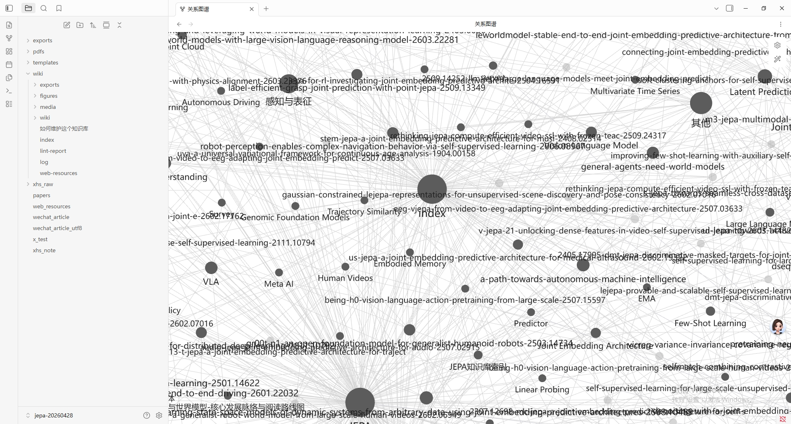
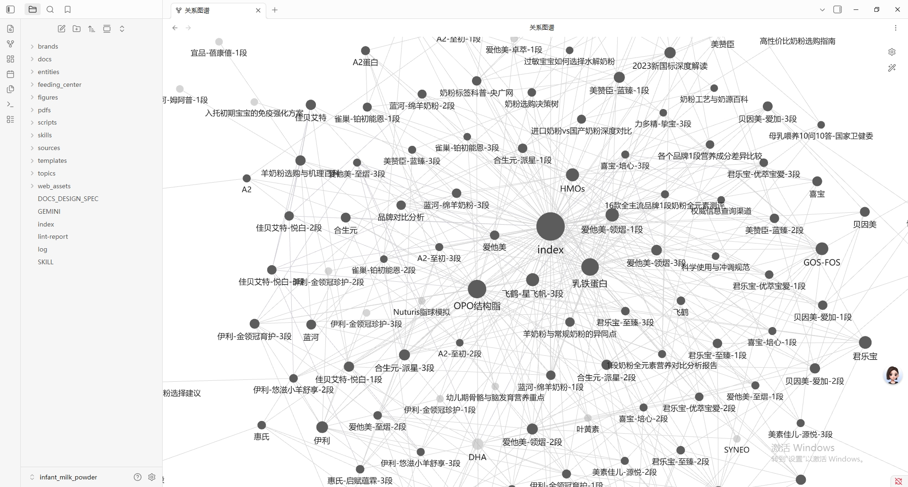

# Personal Wiki: AI-Native Knowledge Internalization Engine 🚀

> *“让知识不再沉睡，用 LLM 驱动信息的深度内化。” —— Personal Wiki 团队*

**Personal Wiki** 是一款面向个人知识管理的“数据中枢型”知识库系统，既适合科研论文，也适合网页文章、URL 书签、仓库链接和混合型资料。

**它的诞生，源于对“收藏夹吃灰”的彻底反思。**
我们每天都在稍后阅读（Read-it-later）列表中囤积大量冷冰冰的论文链接、产品页面、教程文章和优质帖子，但它们很少真正转化为我们的知识。Personal Wiki 的核心愿景是：**将这些沉睡的知识“沉淀”下来，结合 LLM 的力量，将其转化为生动的、互联的个人知识库。**

它不仅帮助你将外部信息不断**内化**为个人的深层知识储备，也允许你把不同类型的输入统一编译成结构化页面，再按需导出与分享。

> 现在的页面结构已经改成 **模板驱动**：模板放在 `templates/<template_id>/manifest.toml + page.md`，可直接自行编辑。`ingest` 时可用 `--template <id>` 显式指定，也可用默认 `auto` 根据输入内容自动选择 `research_paper`、`web_article` 或 `generic`。

---

## 🌟 核心技术理念：llm-wiki 哲学

本项目的灵魂在于 **llm-wiki** 思想 —— 即“知识只需编译一次，随后在 AI 辅助下持续维护与进化”。

1. **结构化编译 (Structured Compilation)**：告别单纯的“剪藏”。无论是复杂的 PDF 论文还是杂乱的网页，均由 Agent 统一“编译”为结构化的 Markdown + JSON 数据。一次摄取，即生成标准的“源码页面”。
2. **多维聚合空间 (Multi-Dimensional Aggregation)**：
   - **Source Pages (源页面)**：知识的本体（如一篇论文、一篇文章、一个仓库或一条书签的结构化页面）。
   - **Entity Pages (实体页面)**：活的知识点。它们会不断累积来自不同条目的观察，形成跨领域的深度见解。
   - **Topic Pages (主题页面)**：主题横向对比。通过自动生成的矩阵表，清晰展现研究脉络或资料结构。
3. **AI 作为知识的链接器 (AI as the Maintainer)**：深度集成 LLM，AI 不仅是做摘要的工具，更是知识库的“园丁”。它负责自动关联概念、修复断链、维护跨页面结构，让知识点之间产生化学反应。
4. **从内化到分享 (From Internalization to Distribution)**：内容本体安全地存储在本地（Git 管理），而通过不同的转换引擎（Adapters），你可以一键将内化后的研究成果，高保真地分发至本地研究 HTML、微信公众号和小红书，完成知识从“输入-消化-输出”的完美闭环。

---

## 🛠️ 核心能力

### 1. 知识摄取 (Ingest)
- **论文摄取**：支持 arXiv、OpenReview 自动抓取，下载 PDF 并提取高清图表（Figures）。
- **全网摄取**：集成 `dokobot`，完美支持微信公众号、知乎、小红书、X (Twitter)、YouTube 视频（含字幕提取）的一键导入。
- **通用条目摄取**：支持将网页文章、仓库链接、书签 URL 等编译为结构化来源页，并按模板自动选择页面形态。
- **自动分类**：AI 自动为内容分配目录、概念标签（Entities）和主题（Topics）。

### 2. 知识库维护 (Maintenance)
- **深度富化 (Enrich)**：自动化填充核心观点、方法摘要、实验结果等章节。
- **关联构建**：基于 `[[WikiLinks]]` 构建双向链接，自动修复断链，维护稳定的跨页面关联。
- **健康检查 (Lint)**：定期扫描知识库，发现空章节、孤立页面或逻辑矛盾。

### 3. 多渠道导出 (Export)
- **本地研究版 (Local HTML)**：生成深色主题、带交互组件（折叠手风琴、架构流图、公式渲染）的 HTML，图片 100% 内联。
- **微信公众号版 (WeChat)**：自动清洗内部链接，修复图片占位符，应用适配移动端的精美排版。
- **小红书卡片版 (XHS)**：自动策划“学霸笔记”大纲，生成视觉提示词（Prompts），配合 AI 生成高美感视觉笔记。

---

## ⚙️ 安装与 LLM 配置

### 0. 系统兼容性

| 功能 | Linux | macOS | Windows |
|---|---|---|---|
| 条目摄取 / Enrich / Export | ✅ | ✅ | ✅ |
| PDF 文本提取（`pypdf`） | ✅ | ✅ | ✅ |
| 微信/知乎抓取（`dokobot`） | ✅ | ✅ | ✅ |
| YouTube 字幕（`yt-dlp`） | ✅ | ✅ | ✅ |
| WeChat HTML 导出（`npx bun`） | ✅ 需装 Node.js | ✅ | ✅ 需装 Node.js |

> Windows 用户建议用 **WSL2** 或 **Git Bash** 运行，避免终端编码问题。
> 若使用 PowerShell，需确保 `$OutputEncoding = [System.Text.Encoding]::UTF8`。

### 1. 安装依赖

```bash
pip install -r requirements.txt
```

核心依赖说明：

| 包 | 用途 |
|---|---|
| `pypdf` | 论文 PDF 文本提取（必须） |
| `beautifulsoup4` | `--web-resources` 功能的 HTML 解析（必须） |
| `requests` | HTTP 请求与 Ollama provider |
| `dokobot` | 微信/知乎/小红书/通用 URL 抓取 |
| `yt-dlp` | YouTube 元数据与字幕提取（`--media`） |

### 2. 配置 LLM 运行模式

本项目将 LLM 调用收敛为两种极简模式：**Agent 协作模式**（默认推荐）与 **API Key 独立运行模式**。系统会根据环境自动切换，通常无需手动指定 Provider。

#### 模式 A：Agent 协作模式 (Direct Inference - 默认推荐)
**这是在 Gemini CLI / Claude Code 等智能体终端中运行时的默认工作流。** 
当系统探测不到有效的 API Key 时，会自动切入此模式：
1. **中断并生成**：脚本会将 LLM Prompt 提取至 `.llm_prompt.txt` 并中断执行。
2. **Agent 处理**：你只需让宿主 Agent 读取该文件，利用其自身的原生大模型能力生成输出。
3. **回填续传**：Agent 将生成的 JSON 或 Markdown 保存为文件，随后带上 `--direct-input <file>` 参数重新运行脚本即可完成闭环。
> **提示**：如果想强制进入此模式，可设置 `provider = "direct-inference"`。

#### 模式 B：API Key 独立运行模式
如果你希望脚本脱离 Agent 独立运行，只需在配置文件中提供对应 API Key，系统即可自动调用。

*   **OpenAI 兼容接口 (如 DeepSeek, Qwen, Kimi 等)**：
    ```toml
    [openai]
    api_key = "sk-xxxxxx"
    base_url = "https://api.deepseek.com/v1"
    ```
    *(注：系统会根据 `model` 名称自动智能匹配配置段，你也可以直接创建 `[deepseek]` 等独立区块)*
*   **Anthropic 接口**：直接配置 `[anthropic]` 区块的 `api_key`，或设置环境变量 `ANTHROPIC_API_KEY`。

---

### 3. 快速验证配置是否正常

```bash
cd /path/to/your/wiki-root
python scripts/enrich_wiki.py \
  --wiki-dir wiki --entries entries.json \
  --only-sources --page-slug <某个source-page的slug> \
  --llm-provider <your-provider>
```

如果成功输出 `Done. Enriched: 1 source pages` 则配置正常。

---

## 🚀 核心工作流：基于 Skill 的 llm-wiki 维护周期

作为一款专为 AI Agent 设计的 **核心 Skill**，Personal Wiki 遵循严谨的“摄取-维护-分发”闭环，AI 既是执行者也是维护者。

### 1. 摄取 (Ingest) — 知识编译的第一步
通过 Skill 指令将外部信息摄取并“编译”为标准 Wiki 页面。
- **论文摄取**：`ingest this paper: [arxiv_id|pdf|url]`
- **网页摄取**：`ingest this article: [url]`
- **通用条目摄取**：`ingest this bookmark: [url]` / `ingest this repo: [url]`
- **AI 动作**：获取元数据、抽取正文或摘要、自动选择模板、分配 `category` 和 `concepts`。

### 2. 富化 (Enrich) — 深度解析
让 AI 阅读 PDF 文本缓存，自动填充存根（Stub）章节。
- **指令**：`enrich the wiki` 或 `enrich this source page`
- **AI 动作**：生成核心观点、方法摘要、实验对比，并建立 `[[WikiLinks]]` 关联。

### 3. 查询与合成 (Query & Synthesis) — 唤醒沉睡的知识
基于已有的结构化数据，进行跨条目的深度问答。
- **指令**：`compare JEPA and MAE in target functions`
- **AI 动作**：读取 `index.md` 和相关页面，合成深度回答。**高价值回答可一键写回 Wiki**。

### 4. 沉浸式阅读与图谱漫游 (Obsidian 原生支持)
你整理的知识库不仅是冷冰冰的文件，更是一个互联的网络。
- **操作方式**：你可以直接使用 **Obsidian** 打开 `wiki/` 目录作为你的 Vault（知识库）。
- **原生体验**：项目完美支持 Obsidian 的双向链接（`[[WikiLinks]]`）、标签过滤和反向链接视图。你可以直观地看到一个新概念是如何被多个条目引用并联系在一起的。

### 5. 健康检查 (Lint) — 消除熵增
保持知识库的整洁与链接的健壮。
- **指令**：`lint the wiki`
- **AI 动作**：扫描断链（Broken Links）、存根（Stubs）、孤立页面（Orphans）并生成报告。

### 6. 分发 (Export) — 多渠道产出
将内化后的研究成果一键转化为面向不同受众的精美页面，分享你的学习体验。
- **全渠道一键导出**：`python scripts/export_article.py [path]`
- **AI 动作**：生成内联图片 HTML、清洗公发版 MD、策划小红书学霸笔记卡片。

> **💡 推荐驱动引擎 (LLM Harness)**
> 本项目作为一个核心 Agent Skill，需要一个强大的智能体外壳来驱动。如果您希望使用 **DeepSeek** 等强大模型作为底层推理大脑，我们强烈推荐使用 [dscode](https://github.com/wangcan26/dscode) 作为大模型驱动框架（Harness）。它可以与 Personal Wiki 无缝结合，为您提供极致的 AI 终端交互体验。

---

## 💡 应用案例 (Use Cases)

Personal Wiki 不仅仅是一个科研工具，它是一种通用的“知识内化”方法论。以下是两种典型的应用场景：

### 案例 1：学术研究 (Academic Research)
面对堆积如山的 arXiv 论文、网页文章、仓库链接和零散书签，Personal Wiki 能将复杂的 PDF 或 URL 提取为结构化的 Markdown 笔记，并在适用时自动抓取论文高清原图。通过 `enrich` 指令，AI 会为你补全方法摘要、条目要点与关联信息。最终，你可以将其一键转换为深色交互式 HTML 供个人沉浸式复习，或者将其打包发布至微信公众号与同行交流。


*图：将晦涩的论文转换为结构化、图文并茂的本地研究库。*


*演示：自动生成的深色交互式 HTML，提供极致的单篇论文精读体验。*


*演示：利用 Obsidian 的图谱与双链，漫游你的学术知识网络。*

### 案例 2：日常硬核调研 —— 以“奶粉调研”为例
生活中的硬核决策（如：新生儿奶粉怎么选？）同样适用。面对知乎、小红书和微信公众号上碎片化、充满营销词汇的评测，你可以用 Personal Wiki 将多篇参考文章统一抓取。AI 充当你的私人研究员，帮你横向对比配方成分、剥离营销话语，并生成客观的购买决策矩阵。将冗杂的网络推文真正内化为你个人的“育儿宝典”。


*图：对繁杂的消费品信息进行结构化清洗与要点提取。*


*演示：日常信息调研也能形成严谨、系统的个人知识体系。*

---

## 📂 项目结构
```
personal_wiki/
├── scripts/              # 核心逻辑脚本 (Python)
│   ├── build_paper_wiki.py     # Wiki 脚手架构建
│   ├── wiki_to_html.py         # 交互式 HTML 导出
│   ├── export_article.py       # 【推荐】一键分发脚本
│   └── prepare_public_md.py    # 微信/公开发布预处理
├── vendor/               # 专家级第三方技能集成 (引自 baoyu-skills)
├── wiki/                 # 你的本地知识库 (Obsidian 兼容)
│   ├── sources/          # 来源条目
│   ├── articles/         # 摄取的网页文章
│   └── exports/          # 自动生成的各平台产出
└── README.md
```

---

## 📅 研发计划 (Roadmap)

### 🟢 已实现 (v1.0 - v1.1)
- [x] **全流程闭环**：研究条目摄取、深度富化、多渠道导出（HTML/WeChat/XHS）。
- [x] **动态环境适配**：彻底解决 URL 解码、图片占位符及跨文章导出路径问题。
- [x] **轻量化依赖**：切换至 `pypdf` 纯 Python 方案，实现跨平台无缝提取 PDF 文本。

### 🟡 开发中 (v1.2: 多模态与视觉增强)
- [ ] **论文插图自动化提取**：智能解析 PDF，自动提取、裁剪并关联论文中的核心架构图、曲线图和数据表。
- [ ] **增强版 OCR 适配层**：为不支持多模态的 LLM（如纯文本版 DeepSeek）提供独立 OCR 能力，确保图像内容可被任何大脑理解。
- [ ] **视觉摘要生成**：支持视频关键帧自动抓取，并结合视觉 LLM 生成带时间戳的视频笔记。

### 🔵 规划中 (v1.3: 生态拓展与体验优化)
- [ ] **模态与模板定制化**：支持更丰富的文档模板（如：播客速记、产品评测、会议纪要），并提供零代码模板定制能力。

### 🔴 愿景 (v2.0: 知识合成与 AIGC 进化)
- [ ] **多模态 AIGC 产出**：将静态知识库“点石成金”——支持根据论文/笔记一键生成解说视频、技术播客或概念海报。

---

## 🙏 致谢 (Acknowledgments)

本项目的诞生离不开开源社区优秀代码与思想的启发，特别致谢以下项目：

- **[JimLiu/baoyu-skills](https://github.com/JimLiu/baoyu-skills)**：本仓库 `vendor/` 目录下的 `baoyu-*` 系列技能均引自该仓库（MIT License），为多渠道“高保真输出”环节提供了强大的基础排版与图像生成能力。
- **[Andrej Karpathy's LLM Wiki](https://gist.github.com/karpathy/442a6bf555914893e9891c11519de94f)**：本项目核心的 `llm-wiki` 哲学直接发轫于 Karpathy 提出的这一构想——放弃每次从头检索（RAG），而是让 LLM 作为“维护者（Maintainer）”，持续构建、交叉引用并维系一个结构化且不断生长的 Markdown 知识库。

---

## 🤝 贡献与反馈
本项目欢迎一切关于提升科研效率和分发质量的建议。

- **反馈问题**：请提交 Issue。
- **参与开发**：欢迎 Fork 并提交 PR，请遵循项目的 Git-on-Change 协议。
